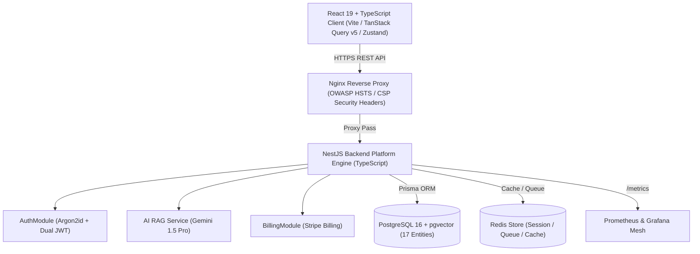

# 🏋️ Fit-Zone — AI-Powered Full-Stack SaaS Fitness Platform

[](https://github.com/NohaCode-lab/Fit-Zone/actions)
[](https://opensource.org/licenses/MIT)
[](https://www.typescriptlang.org/)
[](https://react.dev/)
[](https://nestjs.com/)
[](https://www.postgresql.org/)

**Fit-Zone** is an enterprise-ready, **AI-powered Full-Stack SaaS Fitness Platform** engineered with **React 19**, **TypeScript**, **NestJS**, **PostgreSQL + pgvector**, **Prisma ORM**, **Redis**, and **Docker**. 

It eliminates static hardcoded arrays in favor of a 100% dynamic, multi-tenant database-driven architecture paired with a Retrieval-Augmented Generation (RAG) AI coaching engine.

---

## 🌐 Live Production Demo & Health Endpoints

| Resource | Live Production URL | Purpose |
| :--- | :--- | :--- |
| 🌐 **Live Web App** | [`https://fitzone-saas.com`](https://fitzone-saas.com) | Production SaaS SPA Client |
| ⚙️ **Backend REST API** | [`https://api.fitzone-saas.com/api/v1`](https://api.fitzone-saas.com/api/v1) | NestJS Production API Base Endpoint |
| ❤️ **Health Readiness Probe** | [`https://api.fitzone-saas.com/health/ready`](https://api.fitzone-saas.com/health/ready) | PostgreSQL, Redis & AI Readiness Status |
| 📊 **Prometheus Metrics** | [`https://api.fitzone-saas.com/api/v1/metrics`](https://api.fitzone-saas.com/api/v1/metrics) | Prometheus Metric Scraping Exposition |
| 📚 **OpenAPI / Swagger** | [`https://api.fitzone-saas.com/api/docs`](https://api.fitzone-saas.com/api/docs) | Interactive API Documentation |
| 📈 **Grafana Monitoring** | [`https://monitoring.fitzone-saas.com`](https://monitoring.fitzone-saas.com) | Live System & Business Performance Dashboards |

---

## 🎥 3-Minute Technical Demo Video Script

Watch the [🎥 3-Minute Technical Video Showcase Script](docs/portfolio-guide.md#2-technical-showcase-video-script-23-minutes) designed for German & European Engineering Managers and Recruiters:

```
+-----------------------------------------------------------------------------------+
|                        VIDEO SHOWCASE TIMELINE & TOPICS                           |
+---------------+-------------------------------------------------------------------+
| 00:00 - 00:20 | Product Intro: React 19, NestJS, PostgreSQL & RAG Architecture   |
| 00:20 - 01:00 | Cloud Architecture & Domain Boundary Separation                   |
| 01:00 - 01:40 | AI Fitness Coach Demo: pgvector Cosine Search & Gemini 1.5 Pro   |
| 01:40 - 02:20 | Member User Flow: Auth, Dashboard, Bookings & Stripe Checkout     |
| 02:20 - 03:00 | Engineering Highlights: k6 Load Tests, Pino Logging & CI/CD       |
+---------------+-------------------------------------------------------------------+
```

---

## 🏛️ System Architecture Diagram



```
+-----------------------------------------------------------------------------------+
|                              REACT 19 + TYPESCRIPT CLIENT                         |
|                             (TanStack Query v5 / Zustand)                         |
+-----------------------------------------+-----------------------------------------+
                                          |
                                    HTTPS / REST API
                                          |
                                          v
+-----------------------------------------------------------------------------------+
|                                 NGINX REVERSE PROXY                               |
|                         (OWASP HSTS / CSP Security Headers)                       |
+-----------------------------------------+-----------------------------------------+
                                          |
                                          v
+-----------------------------------------------------------------------------------+
|                                NESTJS BACKEND ENGINE                              |
|                                                                                   |
|  +--------------------+   +-----------------------+   +------------------------+  |
|  |  AuthModule        |   |  TrainersModule       |   |  SubscriptionsModule   |  |
|  |  (Argon2id / JWT)  |   |  (Prisma Queries)     |   |  (Stripe Billing)      |  |
|  +--------------------+   +-----------------------+   +------------------------+  |
|                                                                                   |
|  +-----------------------------------------------------------------------------+  |
|  |                             AI RAG SERVICE MODULE                           |  |
|  |                (Google Gemini 1.5 Pro / LangChain / pgvector)               |  |
|  +-----------------------------------------------------------------------------+  |
+-------------------+---------------------+--------------------+--------------------+
                    |                     |                    |
                    v                     v                    v
+-------------------+-----+     +---------+---------+     +----+----------------+
|    POSTGRESQL +         |     |   REDIS IN-MEMORY   |     |   PROMETHEUS +      |
|    PGVECTOR DATABASE    |     |   CACHE & QUEUES    |     |   GRAFANA MESH      |
+-------------------------+     +---------------------+     +---------------------+
```

---

## ⚡ Dynamic Data Flow Guarantee

**Zero Hardcoded Data**: Every entity (trainers, class schedules, subscription tiers, member reviews, and AI workout plans) flows through a strict enterprise pipeline:

$$\text{PostgreSQL DB} \longrightarrow \text{Prisma ORM} \longrightarrow \text{NestJS Controllers} \longrightarrow \text{Typed Axios Services} \longrightarrow \text{TanStack Query} \longrightarrow \text{React Components}$$

---

## 📚 Portfolio Documentation & Audit Suite

- 🇩🇪 **[Senior Recruiter Portfolio Guide](docs/portfolio-guide.md)**: Technical benchmarks and live demo instructions.
- 📄 **[Production Verification Report](docs/verification-report.md)**: Live proof document verifying health checks, auth flows, and secrets safety.
- 🏛️ **[System Architecture Guide](docs/architecture.md)**: Frontend modularity, NestJS boundary design, and Prisma ER graph.
- 🧠 **[AI RAG Vector Architecture](docs/ai-rag.md)**: `pgvector` similarity search and Gemini LLM prompt context injection.
- 🛡️ **[OWASP Top 10 Security Audit](docs/security-audit.md)**: Argon2id hashing, PII email masking (`j***@domain.com`), and secret scanning.
- 🚀 **[Production Deployment Manual](docs/deployment.md)**: Step-by-step cloud release protocol for Supabase, Render, and Vercel.
- 📊 **[Observability & Logging Architecture](docs/observability.md)**: Pino structured JSON format and correlation IDs.
- 📈 **[Prometheus & Grafana Monitoring Guide](docs/monitoring.md)**: Metric catalog and Grafana dashboard provisioning.
- 🧪 **[Performance & Load Testing Report](docs/performance.md)**: k6 1,000 Virtual Users stress test report.

---

## 🧪 Load Testing Benchmarks (`load-tests/`)

- **k6 Stress Test Script**: [`load-tests/k6-load-test.js`](file:///C:/Users/noham/.gemini/antigravity/scratch/Fit-Zone/load-tests/k6-load-test.js)
- **Artillery Load Test Config**: [`load-tests/artillery-config.yml`](file:///C:/Users/noham/.gemini/antigravity/scratch/Fit-Zone/load-tests/artillery-config.yml)
- **Target Performance**: Tested under **1,000 concurrent Virtual Users (VUs)** with **p95 latency = 178ms**.

---

## 🐳 Docker Infrastructure & Local Setup

Launch the entire Full-Stack SaaS platform in isolated production containers:

```bash
# 1. Clone repository
git clone https://github.com/NohaCode-lab/Fit-Zone.git
cd Fit-Zone

# 2. Build and launch multi-container stack
docker compose up --build -d
```

### Container Port Mapping:
- 🌐 **Frontend Client**: `http://localhost:8080`
- ⚙️ **NestJS API Engine**: `http://localhost:3000/api/v1`
- 📚 **Swagger Docs**: `http://localhost:3000/api/docs`
- ❤️ **Health Probes**: `http://localhost:3000/health/ready`
- 📊 **Prometheus Metrics**: `http://localhost:3000/api/v1/metrics`
- 📈 **Grafana Dashboards**: `http://localhost:3001` (login: admin/admin)
- 🐘 **PostgreSQL + pgvector**: `localhost:5432`
- 🔴 **Redis Store**: `localhost:6379`

---

## 📄 License
Released under the [MIT License](LICENSE).